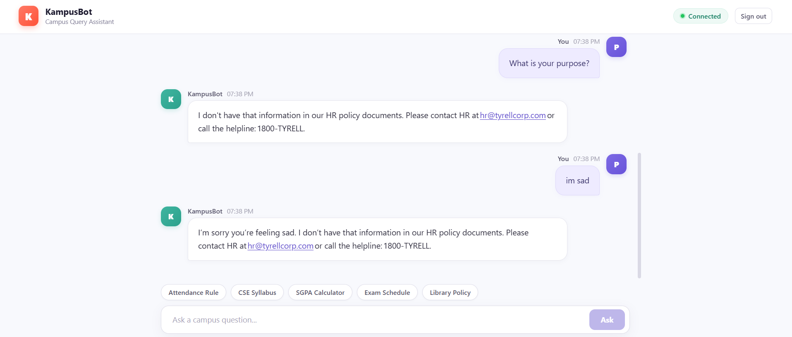

# 🧠 HR Policy RAG Agent

An intelligent HR assistant built using **Retrieval-Augmented Generation (RAG)** that answers employee queries based strictly on company HR policies.

---

## 📸 Demo / Preview

<!-- Replace the link below with your screenshot -->



---

## 🚀 Features

* 📄 Answers HR-related questions using company policy documents
* 🔍 Uses vector search (ChromaDB) for accurate context retrieval
* 🤖 Generates grounded responses using an LLM
* 🛠️ Supports tools:

  * Leave balance calculator
  * Current date/time queries
* 📊 Evaluated using RAGAS metrics (answer relevance, context precision)

---

## 🧠 How It Works

1. HR policy PDF is loaded and split into chunks
2. Text is converted into embeddings
3. Stored in a vector database (ChromaDB)
4. User query → converted to embedding
5. Relevant chunks retrieved
6. LLM generates answer using retrieved context
7. Tools are invoked when needed (e.g., leave calculation)

---

## 🏗️ Tech Stack

* **Python**
* **ChromaDB** (Vector Database)
* **OpenAI / LLM APIs**
* **LangChain (optional depending on your code)**
* **RAGAS** (Evaluation)
* **Streamlit** (Frontend)

---

## 📂 Project Structure

```
.
├── agent.py                  # Core agent logic
├── app.py                    # Backend / orchestration
├── capstone_streamlit.py     # Streamlit UI
├── day13_capstone.ipynb      # Development notebook
├── requirements.txt          # Dependencies
├── README.md
```

---

## ⚙️ Setup & Installation

### 1. Clone the repository

```bash
git clone https://github.com/yourusername/hr-policy-rag-agent.git
cd hr-policy-rag-agent
```

### 2. Create virtual environment

```bash
python -m venv venv
venv\Scripts\activate
```

### 3. Install dependencies

```bash
pip install -r requirements.txt
```

### 4. Add environment variables

Create a `.env` file:

```
OPENAI_API_KEY=your_api_key_here
```

---

## ▶️ Run the App

```bash
streamlit run capstone_streamlit.py
```

---

## 📊 Evaluation

The system is evaluated using **RAGAS metrics**:

* Answer Relevance
* Context Precision
* Faithfulness

---

## ⚠️ Limitations

* Performance depends on quality of HR documents
* Requires API key for LLM usage
* Retrieval may fail if query is too vague

---

## 💡 Future Improvements

* Better retrieval (reranking, hybrid search)
* Multi-document support
* Conversation memory enhancement
* Deployment (cloud / Docker)

---

## 👨‍💻 Author

**Parthiv Datta**
3rd Year B.Tech CSE
